# Pulse Vector Architecture

This document outlines the automated pipeline for the Pulse Vector project, detailing how content is generated, processed, and archived.

## System Workflow Diagram

```mermaid
graph TD
    %% Nodes
    Scheduler([⏰ Windows Task Scheduler<br>8:00 AM Daily])
    Launcher[🚀 run_daily.bat]
    Script[🐍 auto_pulse.py]
    
    subgraph Configuration
        Env[.env<br>API Keys]
        Prompts[.agent/pulse_prompts.md]
    end
    
    subgraph Inputs
        WebSearch[🌐 Google Search<br>Current Affairs]
        Gemini[🧠 Gemini 2.0 Flash<br>AI Processing]
    end
    
    subgraph Outputs
        CA_File[📄 Daily CA Text<br>daily-ddfeb-yyyy_formatted.txt]
        BT_File[🧩 Brain Teaser Text<br>brainteaser-ddfebyy.txt]
        BT_Img[🖼️ Brain Teaser Image<br>brainteaser.png]
    end
    
    subgraph Storage [📂 pulse_archive]
        YearDir{2026}
        MonthDir{February}
        DailyDir[Daily/]
        BTDir[Brain_Teasers/]
    end

    %% Edge Connections
    Scheduler --> Launcher
    Launcher --> Script
    
    Env -.-> Script
    Prompts -.-> Script
    
    Script -->|1. Search News| WebSearch
    WebSearch -->|Raw Data| Script
    
    Script -->|2. Send Prompt + Context| Gemini
    Gemini -->|Formatted Content| Script
    
    Script -->|3. Generate Files| CA_File
    Script -->|3. Generate Files| BT_File
    Script -.->|Future: Generate Image| BT_Img
    
    CA_File --> DailyDir
    BT_File --> BTDir
    BT_Img --> BTDir
    
    DailyDir --> MonthDir
    BTDir --> MonthDir
    MonthDir --> YearDir
    
    %% Styling
    style Scheduler fill:#f9f,stroke:#333,stroke-width:2px
    style Script fill:#bbf,stroke:#333,stroke-width:2px
    style Gemini fill:#cfc,stroke:#333,stroke-width:2px
    style Storage fill:#eee,stroke:#333,stroke-width:2px
```

## Component Description

1.  **Orchestrator (`auto_pulse.py`)**: The core Python script that manages the logic. It reads prompts, fetches news, and calls the AI model.
2.  **Configuration (`.agent/pulse_prompts.md`)**: Contains the "personality" and formatting rules for the AI. Editing this file changes the style of the output without changing code.
3.  **Storage (`pulse_archive/`)**: A structured hierarchy (`Year > Month > Category`) ensuring long-term organization of generated content.
